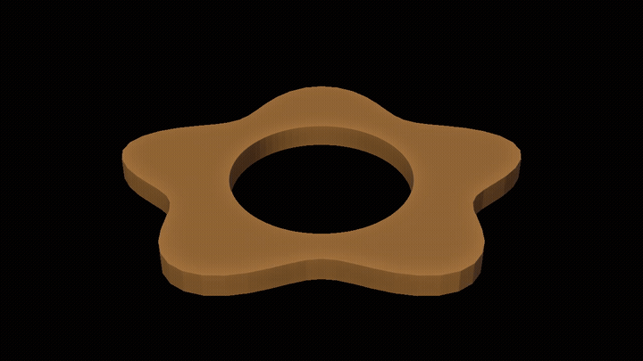

# Exact Radius

A tiny Blender Edit-Mode tool that turns a selected ring of vertices into a
**perfect circle of an exact numeric radius** — at any orientation, for full
circles, holes and partial arcs. It fits the selection's own plane and circle
center, then sets every vertex to the radius you type.

Non-destructive, undo-able, no scaling or applying.

 <!-- TODO: GIF aufnehmen -->

## Why not just use…?

| Tool | What it does | What's missing |
|------|--------------|----------------|
| **Scale (S + number)** | the usual way to resize a ring | scales by a *factor*, not to an absolute radius — you'd need to know the current size and compute the ratio |
| **LoopTools → Circle** | makes a vertex/edge loop circular | needs a clean ordered loop, "Custom Radius" is fiddly, no proper arc / partial-circle support |
| **To Sphere (Shift+Alt+S)** | morphs selection toward a sphere | spherical and factor-based, not an exact circle radius |

**Exact Radius** is the thing you actually want when you reach for Scale: type a
real radius (in mm), and the selection becomes an exact circle — tilted, rotated
or a partial arc, it just works.

## Usage

1. In Edit Mode, select a ring of vertices — a full circle, a hole, or part of
   one (an arc).
2. Press the shortcut (default **Alt+R**), or **Vertex menu → Exact Radius**.
3. **Type the radius and press Enter** — like Move/Scale. You can type a **math
   expression**, e.g. `20/2` to go from a 20 mm diameter to the radius. `Esc`
   cancels. Pressing Enter with nothing typed uses the fitted radius.
4. Afterwards, the **F9** redo panel lets you set the center (Auto / 3D Cursor).

### Good to know

- **Any orientation just works** — the tool fits the selection's own plane, so a
  circle tilted or rotated anywhere in space becomes perfectly round.
- **Partial arcs work** — the center is a least-squares circle fit, so even a
  quarter circle gets the correct center and radius.
- **It checks the selection** — if you select something that isn't a circle (a
  whole face, the whole mesh, a blob), you get a clear error instead of a mess.

## Preferences

- **Shortcut** — a fully editable hotkey field (default **Alt+R** in Edit Mode).
  Click the key field and press your own combination to rebind it, or uncheck the
  box to disable it. It's the standard Blender keymap widget, so it behaves
  exactly like the ones in the Keymap preferences.

## Install

- **Blender 4.2+**: Preferences → Get Extensions, or *Install from Disk* with the
  built `.zip`.
- Source: `blender --command extension build` produces the installable zip.

## License

GPL-3.0-or-later. See [LICENSE](LICENSE).
